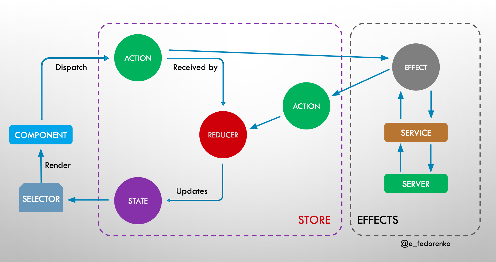

# Ngrx (entity module, Part II)



- [Установка Angular CLI](#install-angular-cli)
- [Запуск Development Backend Server](#run-backend-server)
- [Запуск UI Server](#run-ui-server)
- [adapter](#adapter)
- [selectors](#selectors)
- [Получаем данные в компоненте](#get-data-in-component)
- [Сортировка entity по уник. ключу](#sorting-by-unique-key)
- [Как загружать данные (courses) только по необходимости (если их нет)](#downloading-data-if-needed)
- [Update state after effect](#update-state-after-effect)
## Install angular-cli

При помощи команды ниже angular-cli будет установлена глобально на вашей машине:

`npm install -g @angular/cli`

## Run backend server

Мы можем запустить backend приложение при помощи следующей команды:

`npm run server`

Это небольшой написанный на Node REST API сервер.

## Run ui server

Чтобы запустить frontend часть нашего кода, мы будем использовать Angular CLI:

`npm start `

Приложение доступно на порту 4200: [http://localhost:4200](http://localhost:4200)

## entity format

<span style="color: yellow;">entity data</span> - такие как `courses` (множ-е сущности: `Course[]`),  
но `entity` подразумевают преобразование таких данных в `Map`
(чтобы было легче получать курс уник ключу и тд со своим набором св-в, для работы с мапом)

`CoursesResolver` - спец. сервис, кот выполняется перед срабатыванием навигации роутера \
т.е. это гарантирует, \
что переход на целевую стр будет невозможен пока мы не получим данные


В `reducer` вместо обычного `State` (`courses: Course[]`) определим данные в `entity` формате. \
Автоматизировано <span style="color: yellow;">!</span> `EntityState` (см.ниже):

```ts
export interface CoursesState {
  // делаем (key-value-map) Map entities чтобы было легче получать курс
  // по уник. идентификатору, где key это id
  entities: {[key: number]: Course},

  // массив id для order (группировки - по убывани, дате, и тд в нашем случае по св-ву seqNo)
  ids: number[]
}
```

Чтобы для каждой `entity` (а их может быть много) воспользуемся `EntityState` \
(данный класс под капотом расширит наш интерфейс св-ми `entities`, `ids`):

```ts
export interface CoursesState extends EntityState<Course>{}
```

## adapter

<span style="color: yellow;">adapter</span> позволяет добавлять / удалять (все типичные CRUD операции) и т.д. `entity`, \
то есть делает работу со `state` в `reducer` проще, чем в обычном `reducer`.

`coursesReducer` с адаптером:

```ts
export interface CoursesState extends EntityState<Course>{}
export const adapter = createEntityAdapter<Course>();
export const initialCoursesState = adapter.getInitialState()

export const coursesReducer = createReducer(
    initialCoursesState,
    // при получении данных с бэка сохраяем данные в сторе
    on(allCoursesLoaded, (state, action) => { 
        return adapter.addMany(action.courses, state)
    })
)
export const { selectAll } = adapter.getSelectors(); // selectAll будем использовать, чтобы получить натуральный массив courses в селекторах ***
```

Не забываем зарегистрировать `feature` в `CoursesModule` :

```
StoreModule.forFeature('courses', coursesReducer)
```

##  selectors
```ts
export const selectCoursesState = createFeatureSelector<CoursesState>('courses');

export const selectAllCourses = createSelector(
    selectCoursesState,
    selectAll             // см описание в редьюсере ***
)

export const selectBeginnerCourses = createSelector(
    selectAllCourses,
    (courses: Course[]) => {
        return courses.filter(course => course.category === 'BEGINNER');
    }
)
export const selectAdvancedCourses = createSelector(
    selectAllCourses,
    courses => {
        return courses.filter(course => course.category === 'ADVANCED');
    }
)
export const selectPromoTotal = createSelector(
    selectAllCourses,
    courses => {
        return courses.filter(course => !!course.promo).length;
    }
)
```

## get data in component

```ts
this.beginnerCourses$ = this.store.pipe(select(selectBeginnerCourses))
this.advancedCourses$ = this.store.pipe(select(selectAdvancedCourses));
this.promoTotal$ = this.store.pipe(select(selectPromoTotal));
```
(home.component.ts)

## Sorting by unique key

В `reducer` при создании адаптера добавляем ф-ю сортировки.

```
export const adapter = createEntityAdapter<Course>({
    sortComparer: compareCourses,           // ф-я сортировки
    // selectId: course => course.courseID  // указываем уник. ключ entity
});
```

## downloading data if needed

Данные загружаются при каждом роутинге - в нашем случае при помощи `resolver`, но зачем,
если можно загрузить их один раз.

Добавим в `state` дополнит-й флаг `allCoursesLoaded`, в кот будем смотреть - загружены ли данные или нет:

```ts
export interface CoursesState extends EntityState<Course>{
    allCoursesLoaded: boolean
}
```

Добавим селектор:
```ts
export const areCoursesLoaded = createSelector(
    selectCoursesState,
    state => state.allCoursesLoaded
)
```


Далее получаем курсы в `resolver`:

```ts
resolve(route: ActivatedRouteSnapshot, state: RouterStateSnapshot): Observable<any> {
    return this.store.pipe(
        select(areCoursesLoaded),
        tap((areCoursesLoaded) => {
          // !areCoursesLoaded - проверяем загружены ли курсы или нет
            if (!this.loading && !areCoursesLoaded) { 
                this.loading = true;
                // side effect диспатчит данные и мы переходим на страницу
                this.store.dispatch(loadAllCourses()) 
            }
        }),
        // tap - пробрасывает (след оператору) далее ТОЖЕ значение
        
        // чтобы избежать перехода на страницу пока данные не будут загружены
        filter(areCoursesLoaded => areCoursesLoaded),
        // сработает только 1 раз, если флаг areCoursesLoaded true
        first(),  
        finalize(() => {
            this.loading = false;
        })
    )
}
```

В reducer обновим флаг `allCoursesLoaded` на `true` при получении курсов:

```ts
export const coursesReducer = createReducer(
    initialCoursesState,
    on(allCoursesLoaded, (state, action) => {
        return adapter.addMany(
            action.courses,
            {...state, allCoursesLoaded: true}
        )
    })
)
```

### loading

`loading` ставим в `app.component` и лишь тогда, когда на `router` сработает `NavigationEnd`, 
т.к. мы получаем данные через `resolver`.


## Update data

<span style="color: yellow;">optimistically editing</span> - обновляем в фоне, без показа `loading` индикатора пользователю.

1. Создадим action:

```ts
export const courseUpdated = createAction(
    '[Edit course dialog] Course Updated',
    props<{ update: Update<Course> }>() // Update - спец тип от @ngrx/entity
);
```

2. Диспатчим данные:

```ts
onSave() {
    const update: Update<Course> = {
        id: course.id,
        changes: course
    };
    this.store.dispatch(courseUpdated({update}));
    //...
}
```

3. Дополним reducer (обновляем `store`)

```ts
on(courseUpdated, (state, action) => {
    return adapter.updateOne(action.update, state);
})
```

4. Обновляем backend (в effects)

```ts
saveCourse = createEffect(() => {
    return this.actions$
        .pipe(
            ofType(courseUpdated),
            concatMap(action => {
                return this.coursesHttpService.saveCourse(
                    action.update.id,
                    action.update.changes
                )
            })
        )
    },
    {dispatch: false}
);
```
## Update state after effect

```ts
  switchMap(({ uuid }) => {
    // here we would read user locale
    return this.usersService.fetchUserLocale(uuid).pipe(
      tap((locale) => {
        this.store.dispatch(desiredAction({ uuid }));
      });
    }),
  );
```
